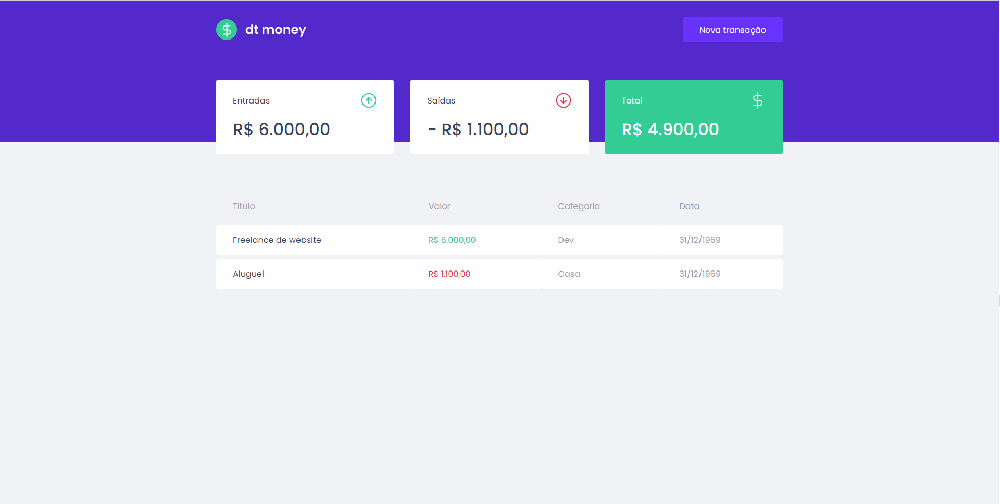

<p align="center">
  
</p>

O dtmoney, é um app de controle financeiro, construido no curso Ignite da [Rocketseat](https://github.com/rocketseat), o dtmoney tem como objetivo mostrar
o seu saldo, de acordo com quanto você gastou e quanto você recebeu.

<p align="center">
  <a href="#test_tube-tecnologias">Tecnologias</a>
   &nbsp;&nbsp;&nbsp;|&nbsp;&nbsp;&nbsp;
  <a href="#rocket-executando">Executando</a>
  &nbsp;&nbsp;&nbsp;|&nbsp;&nbsp;&nbsp;
  <a href="#memo-licença">Licença</a>
 
</p>

## :test_tube: Tecnologias

Esse projeto foi desenvolvido com as seguintes tecnologias:

- [React](https://reactjs.org/)
- [Typescript](https://www.typescriptlang.org/)
- [Axios](https://github.com/axios/axios)
- [MirageJS](https://miragejs.com/)
- [React Modal](https://github.com/reactjs/react-modal)
- [Styled Components](https://github.com/styled-components/styled-components)


## :rocket: Executando

```bash
# Clone o Repositório
$ git clone https://github.com/adelires/dtmoney.git

# Acesse a pasta do projeto
$ cd dtmoney

# Baixe as dependendências
$ npm install

# Execute
$ npm start
```

Acesse <http://localhost:3000> para ver o resultado.


## :memo: Licença

Este projeto está sob a licença [MIT](./LICENSE).

---

Feito com 💚 por Adelires